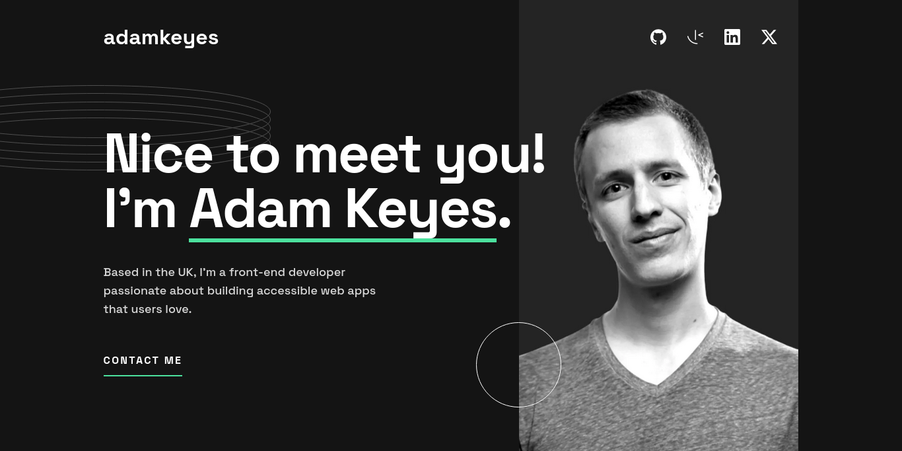

# Frontend Mentor - Single-page developer portfolio solution

This is a solution to the [Single-page developer portfolio challenge on Frontend Mentor](https://www.frontendmentor.io/challenges/singlepage-developer-portfolio-bBVj2ZPi-x). Frontend Mentor challenges help you improve your coding skills by building realistic projects. 

## Table of contents

- [Overview](#overview)
  - [The challenge](#the-challenge)
  - [Screenshot](#screenshot)
  - [Links](#links)
- [My process](#my-process)
  - [Built with](#built-with)
  - [What I learned](#what-i-learned)
  - [Useful resources](#useful-resources)
- [Author](#author)
- [Acknowledgments](#acknowledgments)

## Overview

### The challenge

Users should be able to:

- Receive an error message when the `form` is submitted if:
  - Any field is empty
  - The email address is not formatted correctly
- View the optimal layout for the interface depending on their device's screen size
- See hover and focus states for all interactive elements on the page
- **Bonus**: Hook the form up so it sends and stores the user's enquiry (you can use a spreadsheet or Airtable to save the enquiries)
- **Bonus**: Add your own details (image, skills, projects) to replace the ones in the design

### Screenshot

### Links

- Solution URL: [Github](https://github.com/ahmadkdev/developer-portfolio)
- Live Site URL: [Netlify](https://devportfoliosp.netlify.app/)

## My process

### Built with

- Semantic HTML5 markup
- Accessibility In Mind
- CSS
  - Flexbox
  - Grid Layout
  - Custom properties
  - Native nesting
  - Container queries
- Mobile-first workflow
- [Postcss](https://postcss.org/) - CSS Preprocessor
- [pnpm](https://pnpm.io/) - Package Manager

### What I learned

My goal was to produce a fast, performant, accissible and responsive website, and discover CSS latest technologies.
I learnt about and used CSS Native Nesting, Container Queries etc.
I also learnt how to analyse CSS Code Complexity and used [Project Wallace](https://www.projectwallace.com/) to improve my CSS code and I got 100% score in all CSS code quality sections 🎉
I learnt about HTML Form client-side validation and JavaScript Constraint Validation API.
I kept Accessibility in my mind during every stage of development. I used [Wave Evaluation Tool](https://wave.webaim.org/) to test my site and ensured no errors or alerts related to accessibility.
I also used Google Chrome devtools to measure many aspects of my site's performance and scored 100% in [LightHouse](https://developer.chrome.com/docs/lighthouse/overview) 🎉

This is good for now and later I'm going to publish a detailed article about what I've learnt.

### Useful resources

- [Invisible Content Just for Screen Reader Users](https://webaim.org/techniques/css/invisiblecontent/) - This is an amazing article which helped me to understand different techniques and use-cases for hiding content. I'd recommend it to anyone still learning this concept.
- [The Guide To Responsive Design In 2023 and Beyond](https://ishadeed.com/article/responsive-design/)
- [The new responsive: Web design in a component-driven world](https://web.dev/articles/new-responsive) These amazing articles helped me to discover latest CSS techniques. I'd recommend it to anyone aiming to keep up-to-date in CSS.
- [google-webfonts-helper](https://gwfh.mranftl.com/fonts) - This amazinge tool helped me for optimizing google fonts.

These was some useful resources and I'll add more later.

## Author

- Frontend Mentor - [@ahmadkdev](https://www.frontendmentor.io/profile/ahmadkdev)
- Linkedin - [@ahmadkhaliddev](https://www.linkedin.com/in/ahmadkhaliddev/)
- Twitter - [@ahmadkhalidmo](https://twitter.com/ahmadkhalidmo)

## Acknowledgments

I deeply thank [Fronend Mentor](https://www.frontendmentor.io) for their amazing designs.
and many thanks to [Coder Coder](https://www.youtube.com/@TheCoderCoder) Her amazing tutorials really helped me alot.
